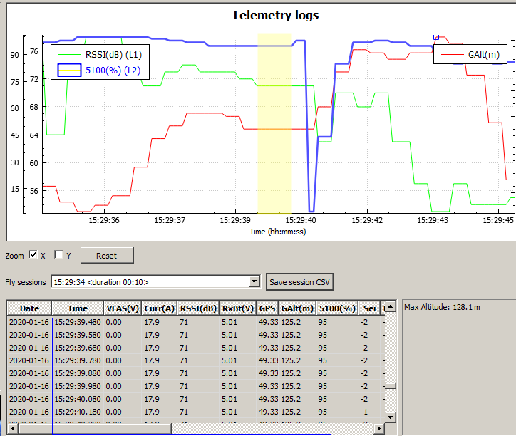

# OpenTX Telemetry Freeze Check

Simple Script to detect frozen values in OpenTX telemetry logs. These may be an indication for _lock outs_, where the connection between TX and RX is lost. The problem is discussed in various RC forums e.g. at [ fpv-community.de](https://fpv-community.de/threads/vorsicht-bei-telemetrie-verloren-mit-horus.84554/).

The script analyzes a telemetry log file and creates a new log file, including the detected problem areas as separate sessions. In Companion Log Viewer these sessions can be selected; the possible error is displayed in the middle of the graph.




Since unchanged telemetry data can also occur in reality, the script cannot distinguish them from frozen values. The more sensors are used, the less false reports are expected. The logging interval should be set to 0,1 or 0,2 seconds to get the necessary temporal resolution.

## Prerequisites

Since this is a Python script, Python must be installed. It was written on MS Windows platform; OS specific modifications may be necessary. The `csv` module is used.

## Usage

It is an command line script. You have to open an Windows Command Prompt (or e.g an Unix shell).

**python OTX_FreezeCheck.py**  _FILE_  [ms]

_FILE_
:  OpenTX telemetry file (`csv`)

ms
:  minimum time range to detect _(milliseconds)_. Default: 800 ms

Two files are created:

* telemetry log file `_err.csv` containing the detected problematic ranges.  5 seconds before/after are added
* protocol `.log` with additional informations.

## Example content of protocol

```
Error: Mindestschwelle dt ungültig oder nicht gesetzt => Default >800
1. TX-Spalte: 9
Vergleichswerte: VFAS(V),Curr(A),RSSI(dB),RxBt(V),GPS,GAlt(m),5100(%)
n=5608 t=15:59:40.690-15:59:41.690 dt= 1000  RSSI=065
LogDiff 100ms
Fehler: 1
Err 0: 5598-5608 (5548-5658)

```
### Explanation

1. minimum time range (not set => default 800 ms used)
2. column where TX-values begin (TX values are ignored in comparison)
3. values used for comparison: VFAS etc.
4. **n** = line number of ending error range.  **t** = time range. **dt** duration in ms
5. **LogDiff** = logging intervall
6. number of errors
7. line numbers range of error. Number in brackets including 5 seconds before/after 